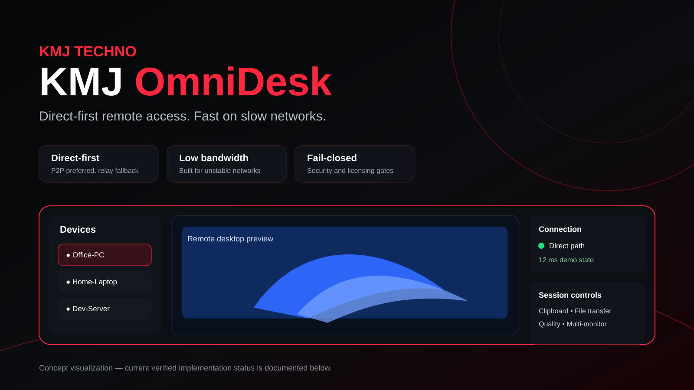
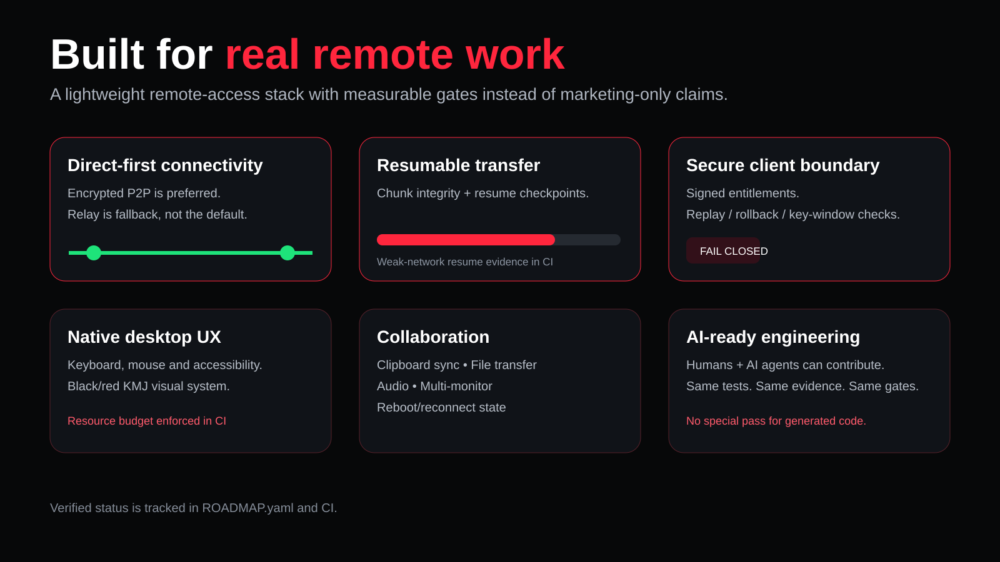
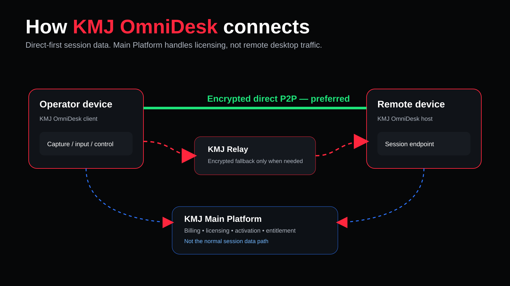

<div align="center">

# KMJ OmniDesk

### Direct-first remote access built for speed, resilience, and measurable trust.

[](https://github.com/kmjtechno/kmj-omnidesk/actions/workflows/ci.yml)
[](https://github.com/kmjtechno/kmj-omnidesk/stargazers)
[](https://www.rust-lang.org/)
[](#current-status)
[](#security-first)

**Remote access should stay fast when the network gets difficult.**

[Architecture](#architecture) · [Verified status](#current-status) · [Engineering](#build-with-us) · [Roadmap](./ROADMAP.yaml) · [Security](./SECURITY.md)

</div>



> [!IMPORTANT]
> **KMJ OmniDesk is pre-alpha.** There is no public production release yet. The visuals in this README are product/concept illustrations; verified implementation status is listed explicitly below. Performance, platform, pricing, and availability claims are not treated as complete until their release gates pass.

## Why KMJ OmniDesk

Most remote-access products become expensive or inefficient when every session depends on central infrastructure. OmniDesk is being engineered around a different rule:

> **Use the direct encrypted path whenever it is safe and possible. Use relay only when it is actually needed.**

That architecture is intended to reduce unnecessary server bandwidth, improve responsiveness, and keep the product viable on constrained or unstable networks—without weakening authentication, authorization, or licensing controls.

| Principle | What it means in OmniDesk |
| --- | --- |
| **Direct-first** | Authenticated encrypted P2P is preferred; relay is fallback. |
| **Low-bandwidth by design** | Weak-network behavior is treated as a first-class engineering problem. |
| **Fail-closed security** | Unknown, stale, replayed, revoked, malformed, or unverified state is rejected. |
| **Lightweight native UX** | The desktop shell is measured against explicit CPU/memory budgets. |
| **Evidence over claims** | CI, schemas, deterministic test vectors, and real-network campaigns gate milestone status. |
| **Commercially governable** | KMJ Main Platform owns billing/licensing; it does not become the normal session data path. |



## Current status

The project is moving quickly, but the README intentionally separates **verified implementation** from **in-progress** and **planned** work.

### Verified / implemented

- Native Windows desktop shell with the KMJ black/red visual system.
- Keyboard and mouse interaction paths.
- OS-level accessibility integration through AccessKit.
- Device selection, permission flow, session controls, quality controls, and connection statistics.
- Fail-closed offline-device handling.
- Enforced desktop resource budget in CI.
- Clipboard policy and replay-safe clipboard synchronization state.
- Integrity-checked resumable file transfer checkpoints.
- Deterministic weak-network resume evidence.
- Remote-audio permission lifecycle model.
- Multi-monitor selection model.
- Bounded reboot/reconnect state.
- KSLP-v1 client licensing contract.
- Real Ed25519 entitlement verification.
- Exact-payload parse → signature verification → policy evaluation.
- Product/device/install binding, sequence/replay protection, revocation handling, and clock rollback detection.
- Signed plan, capability, and resource-limit enforcement.
- ACTIVE / ROLLOVER / REVOKED verification-key states with trusted-time validity windows.
- Committed cryptographic and lifecycle test vectors executed in CI.

### In progress

- **M4 — Internet direct connectivity:** the REALNET-60 evidence system is implemented; the remaining gate is the real public-network 60-run campaign across representative NAT/CGNAT/restrictive scenarios.
- **M9 — Production licensing integration:** the client enforcement path is hardened; production Main Platform signer/KMS integration and cross-service proof remain gated.

### Planned after dependency gates

Relay hardening, adaptive media/quality, commercial activation, unattended-service integration, packaging/updating, final security/performance hardening, and release readiness.

See the machine-readable execution source of truth: **[ROADMAP.yaml](./ROADMAP.yaml)**.

## Architecture



```text
                   KMJ Main Platform
           billing / licensing / entitlement
                        │
                        │ HTTPS control only
                        ▼
┌────────────────┐   signaling/discovery   ┌────────────────┐
│ Operator       │ ◄─────────────────────► │ Remote device  │
│ OmniDesk       │                         │ OmniDesk       │
└───────┬────────┘                         └───────┬────────┘
        │                                          │
        └════ authenticated encrypted direct ═════┘
                         │
                  direct unavailable
                         ▼
                    KMJ Relay
                encrypted fallback
```

**Architectural rule:** KMJ Main Platform is the commercial authority for billing, plans, licensing, activation, renewal, and revocation. It must **not** become the normal screen/audio/session-data path.

## What OmniDesk is being built to deliver

### Remote session

- Desktop viewing and keyboard/mouse control
- Attended and unattended access
- Multi-monitor workflows
- Clipboard synchronization
- Resumable file transfer
- Remote audio
- Reboot/reconnect
- Adaptive quality controls

### Connectivity and performance

- NAT traversal and direct-path preference
- Explicit direct/relay metrics
- Reconnect state and recovery
- Low-bandwidth operating modes
- Hardware encode/decode where platform support allows
- Reproducible resource and latency gates

### Enterprise and security direction

- Device trust and explicit authorization
- Signed entitlement enforcement
- MFA/SSO/RBAC direction
- Organization policy
- Auditability
- Managed-device deployment direction
- Key rotation and revocation
- Commercial controls through KMJ Main Platform

## Security first

OmniDesk treats remote control as a privileged security boundary.

The project uses fail-closed behavior for authentication, permissions, entitlement verification, replay protection, revoked keys, stale sequence numbers, temporal inconsistencies, malformed signed payloads, and device binding.

Production signing keys, master secrets, private KMS/HSM material, and commercial authority **must never be stored in this repository or shipped in the client**.

Read:

- [SECURITY.md](./SECURITY.md)
- [Threat model](./docs/THREAT_MODEL.md)
- [Protocol rules](./docs/PROTOCOL.md)
- [Licensing architecture](./docs/LICENSING.md)

## REALNET-60: proving direct connectivity

OmniDesk does not mark Internet direct-connect complete from localhost or synthetic tests.

M4 uses a defined real-network campaign:

| Scenario | Required VALID runs |
| --- | ---: |
| Broadband NAT ↔ Broadband NAT | 10 |
| Broadband NAT ↔ 5G/CGNAT | 10 |
| CGNAT ↔ CGNAT | 10 |
| Broadband ↔ restrictive network | 10 |
| IPv4 NAT ↔ IPv6-capable endpoint | 10 |
| Direct session → disruption → reconnect | 10 |
| **Total** | **60** |

The repo already contains strict schemas, a semantic validator, evidence collection helpers, checksum validation, deterministic local gates, and CI enforcement. **Real public-network evidence is still required before M4 can be declared complete.**

See [docs/M4_REALNET_60.md](./docs/M4_REALNET_60.md).

## Lightweight by policy

The native desktop experience is not allowed to become heavy just because the UI becomes more polished.

The Windows desktop CI currently enforces:

- working set **≤ 64 MiB**
- idle CPU **≤ 500 milli-percent (0.5%)**

These are engineering gates, not marketing estimates.

## Commercial model

KMJ OmniDesk is designed to become a sustainable commercial product while retaining a strong entry experience.

Planned commercial families include:

- Personal / Free
- Trial
- Professional
- Business
- Enterprise
- OEM / Custom

```text
product_slug: kmj-omnidesk
product_id:   KMJ_OMNIDESK
authority:    KMJ Main Platform
```

Commercial access will remain entitlement-driven. **No client-side hard-coded “premium unlock” is accepted.** Public purchasing will stay disabled until the corresponding production licensing and release gates are verified.

For company/product enquiries: **https://kmjtechno.com**

## Developer quick start

### Prerequisites

- Rust stable toolchain
- Git
- Windows for the current native desktop host

### Verify the workspace

```bash
git clone https://github.com/kmjtechno/kmj-omnidesk.git
cd kmj-omnidesk

cargo fmt --all -- --check
cargo clippy --workspace --all-targets --all-features -- -D warnings
cargo test --workspace --all-targets
```

On Windows, the native desktop package can then be exercised from the workspace as development progresses.

> Do not treat a successful local run as release evidence. The repository CI and milestone-specific acceptance gates remain authoritative.

## Repository map

```text
crates/       Rust core and desktop libraries
apps/         Application entry points
services/     Signaling / relay direction
protocol/     Versioned wire and licensing contracts
schemas/      Strict evidence / validation schemas
docs/         Architecture, security, UX, licensing, M4 evidence
scripts/      Deterministic evidence and CI helpers
tests/        Integration and security tests
benchmarks/   Reproducible performance gates
```

## Build with us

KMJ OmniDesk is being engineered as a **human + AI collaborative codebase**.

Contributions produced with ChatGPT, Claude, Codex, Gemini, local coding agents, or other AI systems are welcome **only when they meet the same engineering bar as human-written code**:

1. no bypassing CI;
2. no fabricated benchmark or test evidence;
3. no weakening security gates to get green;
4. no production secrets;
5. deterministic tests for new contracts and critical behavior;
6. exact-head green before merge;
7. milestone status changes only after the declared acceptance gates are actually satisfied.

That means AI can increase development speed—but it does not get a special pass on correctness.

## Engineering discipline

A feature is not “done” because it compiles.

A change is considered merge-ready only when the relevant format, lint, test, platform, resource, security, schema, and evidence gates pass on the exact commit being merged.

Core references:

- [ROADMAP.yaml](./ROADMAP.yaml)
- [Architecture](./docs/ARCHITECTURE.md)
- [Protocol](./docs/PROTOCOL.md)
- [Threat model](./docs/THREAT_MODEL.md)
- [Licensing](./docs/LICENSING.md)
- [REALNET-60](./docs/M4_REALNET_60.md)

## Help make OmniDesk better

If the project direction is useful to you:

- ⭐ **Star the repository** to help more developers discover it.
- 🐛 Open reproducible issues for bugs and edge cases.
- 🧪 Contribute network, accessibility, security, and performance test cases.
- 💡 Propose improvements with measurable acceptance criteria.
- 🔐 Report security-sensitive findings through the repository security process rather than public exploit details.

<div align="center">

### Access without distance.

**KMJ TECHNO · Innovate · Build · Scale**

[Star KMJ OmniDesk](https://github.com/kmjtechno/kmj-omnidesk/stargazers) · [View roadmap](./ROADMAP.yaml) · [KMJ TECHNO](https://kmjtechno.com)

</div>


## Explore the KMJ open-source ecosystem

If you discovered this project through one KMJ tool, the rest of the stack may be useful too:

- **[KMJ CodeBridge](https://github.com/kmjtechno/kmj-codebridge)** — secure AI-to-project connectivity for authorized development environments.
- **[KMJ OmniDesk](https://github.com/kmjtechno/kmj-omnidesk)** — direct-first remote access engineered for speed, resilience, and measurable trust.
- **[KMJ Desktop Commander](https://github.com/kmjtechno/kmj-desktop-commander)** — policy-controlled desktop and remote engineering operations.
- **[KMJ Forge](https://github.com/kmjtechno/kmj-forge)** — evidence-driven software engineering workflows for humans and AI.

**KMJ TECHNO · Innovate · Build · Scale** — https://kmjtechno.com
